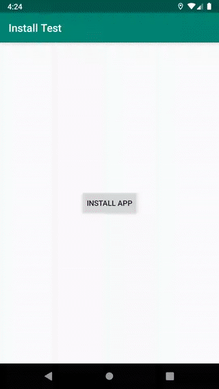
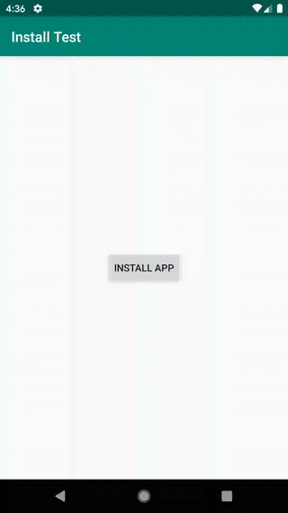

# attended-install-demo
Sample app to test post-install deep link on Android Q

Reproduces [Android Q issue reported here](https://issuetracker.google.com/issues/135665165) that prevents automatically launching a newly installed app via deep link.

### Steps to reproduce

0. Esure the Boxed app is not installed
1. Build and run the app
2. Click "Install App" button
3. When redirected to play store, click "Install" to install the app

### Expected Behavior

After the app install completes, the Boxed app is opened automatically and deep links to the correct product. This is the behavior on Android P and lower.

### Actual Behavior

On Android Q, instead of starting the Boxed app, a toast message is displayed "Background activity start from com.example.installtest blocked. See g.co/dev/bgblock."

